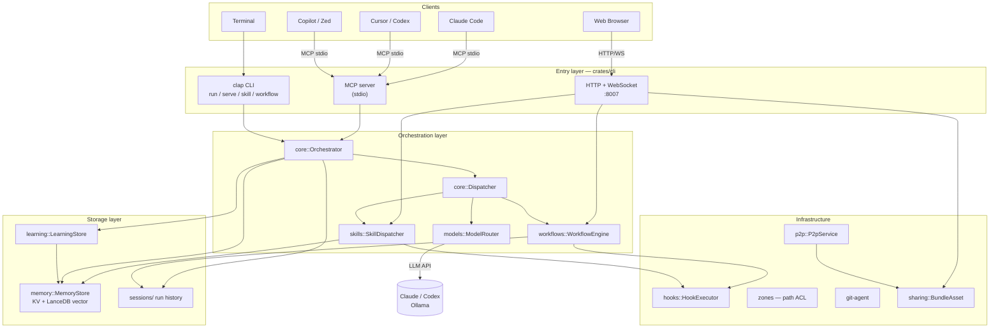
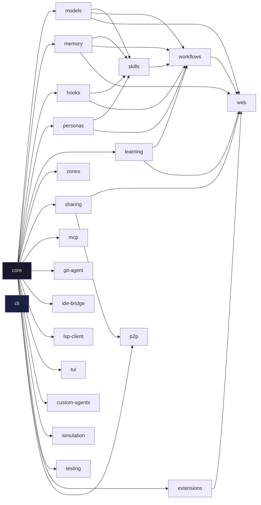
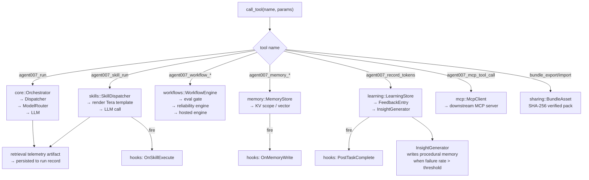
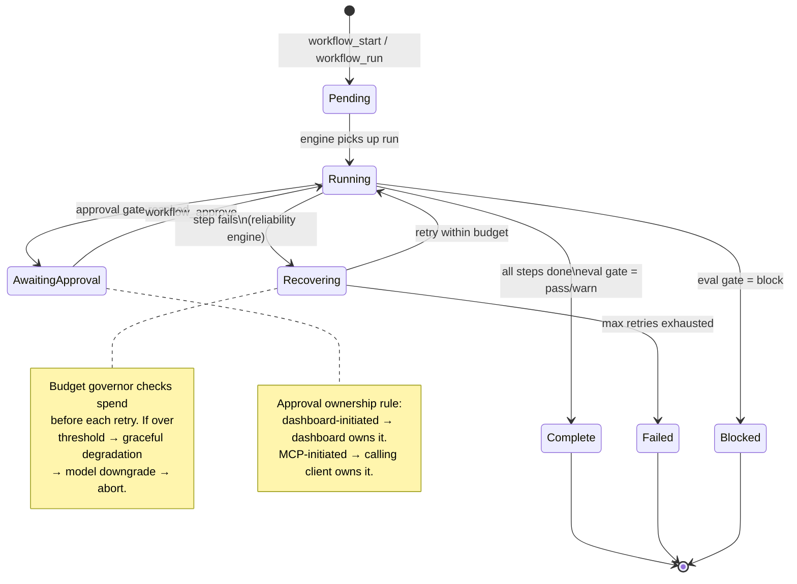
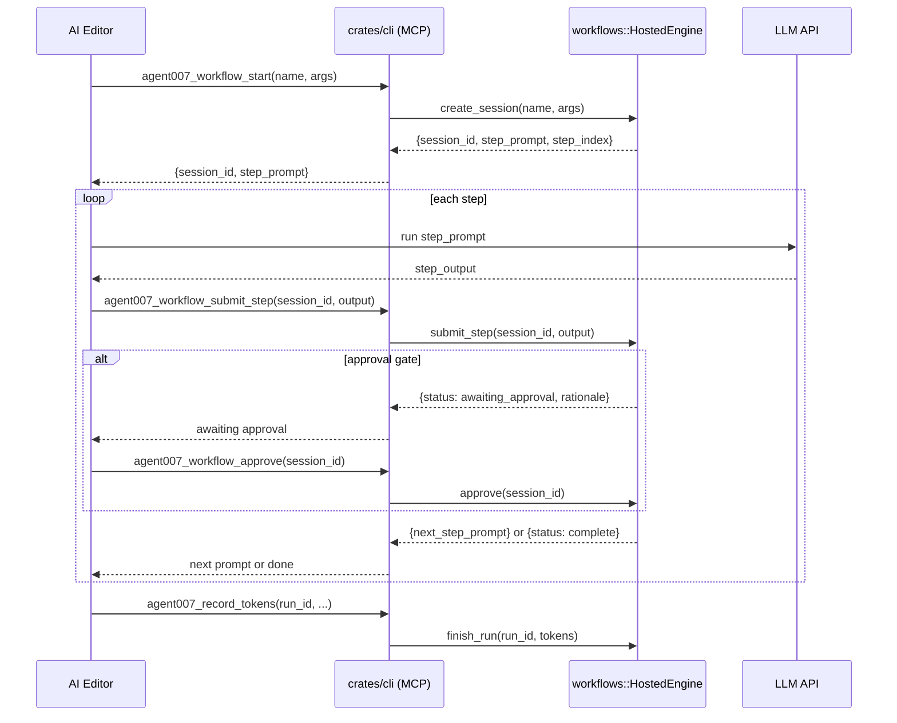
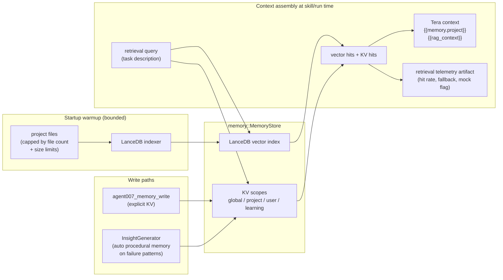
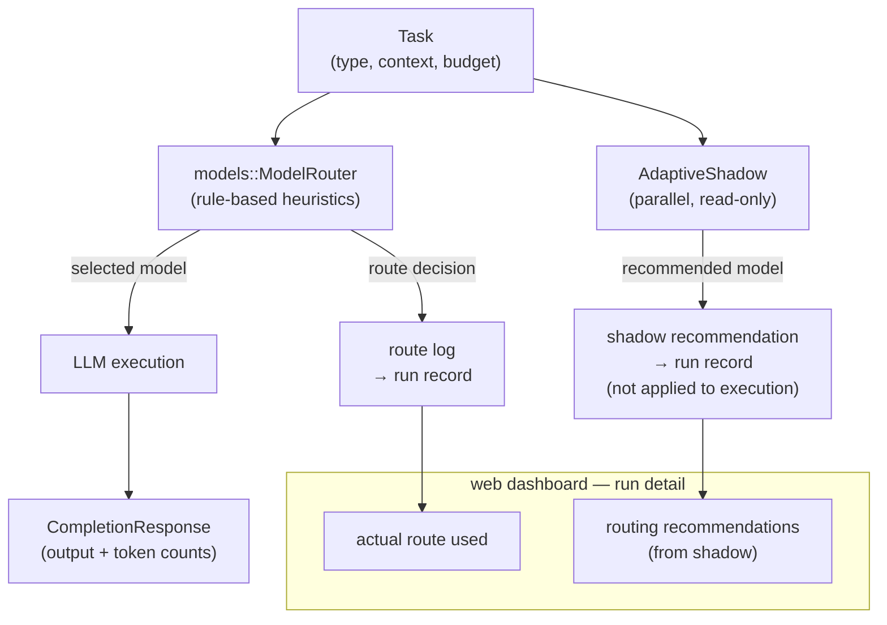
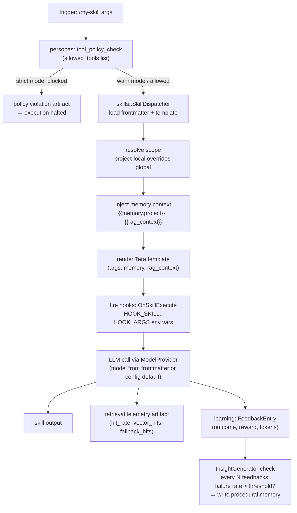
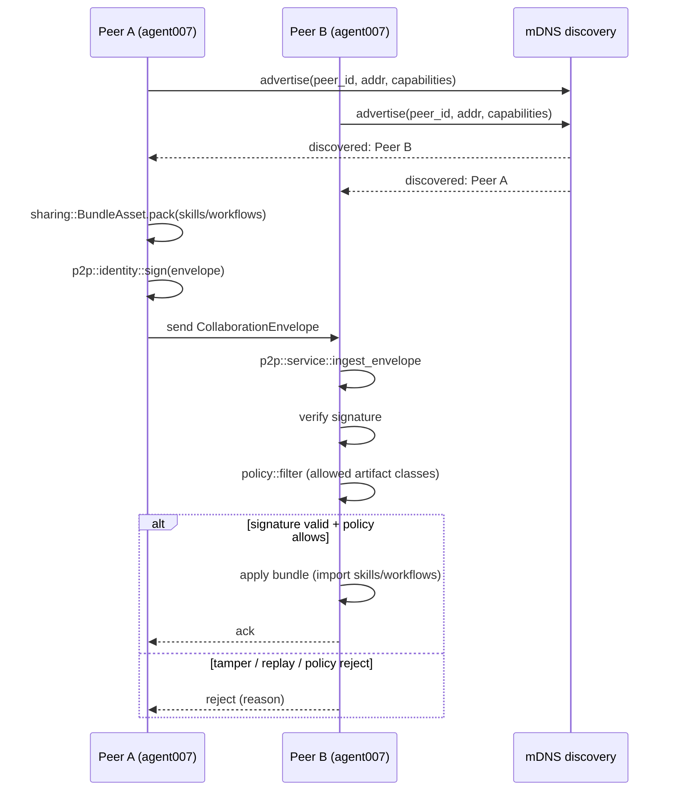

# Architecture

agent007 is a layered Rust workspace of 22 crates. The CLI binary (`crates/cli`) is the only binary; all other crates are libraries.

---

## Layer overview



---

## Crate dependency graph



> `crates/cli` depends on every crate above and is the binary assembly point.
> `crates/core` is the dependency root — it defines `Task`, `AgentId`, `Dispatcher`, `Budget`, and the shared context types that all other crates consume.

---

## MCP tool call dispatch



---

## Workflow run lifecycle



---

## Hosted workflow session protocol

The hosted engine lets a MCP-connected LLM (Claude Code, Cursor, etc.) execute each workflow step itself, step-by-step, via a session loop.



---

## Memory and RAG context assembly



`AGENT007_RAG_WARMUP=0` disables startup indexing. Graceful degradation applies when the LanceDB path is unavailable — retrieval falls back to KV-only.

---

## Model routing and adaptive shadow



Routing rules use: task type tag, budget pressure, historical success scores from `learning::LearningStore`. The shadow never changes execution — it only accumulates advisory recommendations for human review and eventual policy tuning.

---

## Skill execution path



---

## P2P collaboration and sharing



Sharing is opt-in and policy-gated. Unknown peers are rejected at ingest. Replay protection is enforced in `P2pService::ingest_envelope`. Raw prompts and outputs are excluded from bundles by default.

---

## Key interfaces

### `core::Dispatcher`
```rust
pub trait Dispatcher: Send + Sync {
    async fn dispatch(&self, task: Task) -> Result<TaskResult>;
}
```
`LocalDispatcher` implements this directly. The `learning_dispatcher` wraps it and records `FeedbackEntry` on each completion.

### `models::ModelProvider`
```rust
pub trait ModelProvider: Send + Sync {
    async fn complete(&self, req: CompletionRequest) -> Result<CompletionResponse>;
}
```
`CompletionResponse` carries `input_tokens` and `output_tokens` parsed from the provider's API `usage` field.

### `skills::SkillDispatcher`
Loads skills from `~/.agent007/skills/` (global) and `.agent007/skills/` (project-local), scanning recursively to support skill folders. Project skills override global skills with the same trigger. Each skill is a `SkillFrontmatter` + template body rendered with Tera.

### `memory::MemoryStore`
Scoped key-value with optional LanceDB backend. Scopes are namespaced subdirectories under `~/.agent007/memory/`. `MemoryStore::scoped("name")` requires `Arc<MemoryStore>`.

### `hooks::HookExecutor`
Reads `HookConfig` from `hooks.toml`. `fire(event, env_vars)` spawns a subprocess synchronously. Hook commands receive context via environment variables (`HOOK_SKILL`, `HOOK_KEY`, etc.).

### `learning::LearningStore`
`LearningStore::new(ScopedMemoryStore)` + `record_feedback(&FeedbackEntry)`. Each `FeedbackEntry` has: `id`, `agent_id`, `model`, `skill_name`, `outcome`, `reward`, `timestamp`. Written to the `learning` scope in memory. Additional methods: `count_feedback(skill)`, `list_skill_names()`.

### `learning::InsightGenerator`
Attached to `FeedbackCollector` via `with_insight_generator(Arc<InsightGenerator>)`. After each `TaskCompleted` event, checks whether the skill's feedback count crosses a multiple of `check_every_n`. If the failure rate exceeds `min_failure_rate`, calls the configured LLM model and writes a `type: procedural` memory entry to the `project` scope. The entry is immediately available via `{{memory.project}}` and `{{rag_context}}`. See ADR-007.

### `workflows::WorkflowEngine`
Parses `~/.agent007/workflows/<name>.yaml`. Builds a dependency graph (petgraph). Steps without `depends_on` run in parallel. Approval gates block progression until `workflow_approve` is called. Hosted-MCP mode: the engine emits step prompts; the host LLM executes and submits outputs back.

**V2 subsystems (opt-in, backward-compatible):**
- **Eval Gates** (`eval_gates.rs`) — score each run against a rolling baseline; make `pass / warn / block` decisions. Configurable per workflow via `eval_gate:` YAML block.
- **Reliability Engine** — four additive controls: budget governor (token spend tracking with graceful degradation), guardrails hook (pre-step safety check), confidence-driven escalation (routes low-confidence output to human approval), recovery transitions (bounded retry with explicit transition records).
- **Hosted Engine** (`hosted.rs`) — session-based loop for multi-step workflows where the host LLM runs each step. Approval ownership follows the initiating client.

### `models::ModelRouter` + Adaptive Shadow
Rule-based routing selects the model for each task. Adaptive Shadow runs alongside every step, recording which route *would* have been recommended based on historical performance — without changing the actual route. Shadow recommendations accumulate in the run record and surface in the web dashboard under **Routing Recommendations**.

---

## Directory layout (~/.agent007/)

```
~/.agent007/
├── config.toml          Main configuration
├── skills/              User-defined skills (*.md, nested folders supported)
├── personas/            User-defined personas (*.md)
├── workflows/           User-defined workflows (*.yaml)
├── hooks/
│   └── hooks.toml       Hook configuration
├── memory/
│   ├── global/          Global key-value
│   ├── project/         Project-scoped key-value
│   ├── user/            User-scoped key-value
│   └── learning/        FeedbackEntry records
├── sessions/            Run history (JSON per run)
└── ports.toml           Per-project port registry
```
